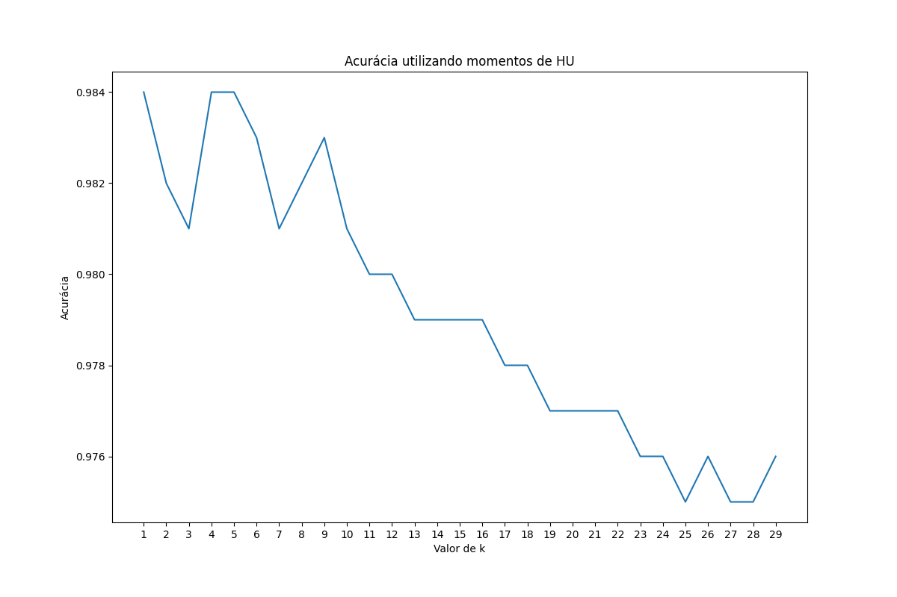
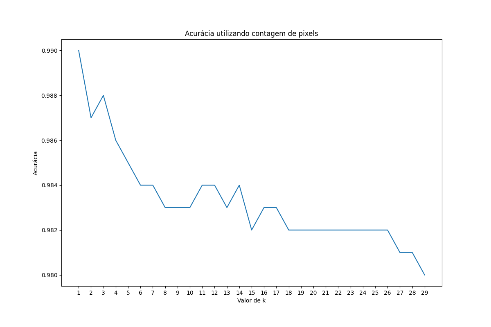

# Projeto 03 - Template Matching
O objetivo deste projeto, é utilizar o algoritmo Knn sob a base de dados de dígitos, disponibilizado pelo professor (mais detalhes no [arquivo](data/README.md)), e a acurácia particionando a imagem, e calculando tanto os momentos de HU como os pixels.

# Como executar
Inicialmente, é necessário fazer o download do conjunto de dados, disponibilizado pelo professor, e colocar na pasta `data/` as duas pastas `teste/` e `treino/`. Após isso, precisa rodar o arquivo [Calculo_HU.m](Calculo_HU.m) para calcular os momentos de HU, e o arquivo [Calculo_Pixel.m](Calculo_Pixel.m) para calcular os pixels. Depois de finalizado, basta executar o arquivo [Execucao_Knn.ipynb](Execucao_Knn.ipynb) para rodar o programa e gerar os resultados.

# Resultados
Foram testados vários valores de k, indo de 1 a 29. Para os momentos de HU, as imagens foram divididas em 255 quadrantes, e para a contagem de pixels, as imagens foram divididas em 36 quadrantes. Os resultados para ambas as técnicas são mostradas logo abaixo.

    

    

Foi gerado um documento com os resultados obtidos, ele está disponível no [relatório](pdf/relatorio.pdf).