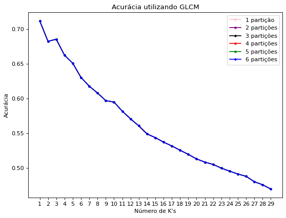
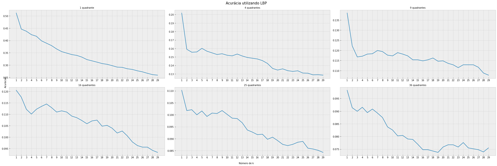
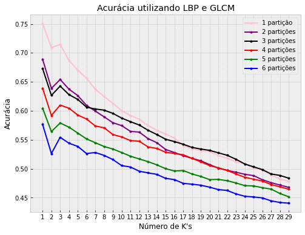

# Projeto 04 - Descritores de Textura e k-NN
O objetivo deste projeto, é utilizar o algoritmo Knn sob a base de dados BFL, disponibilizado pelo professor (mais detalhes no [arquivo](data/README.md)), e verificar a acurácia particionando a imagem em diferentes quadrantes, e para cada quadrante, realizar o cálculo do LBP e GLCM.

# Como executar
Inicialmente, é necessário fazer o download do conjunto de dados, disponibilizado pelo professor, e colocar na pasta `data/`. Após isso, precisa rodar o arquivo [main.m](main.m) apenas alterando os parâmetros dos quadrantes, no experimento foi testado: 1 quadrante (1 partição vertical e 1 partição horizontal), 4 quadrantes (2 partições verticais e 2 partições horizontais), 9 quadrantes (3 partições verticais e 3 partições horizontais), 16 quadrantes (4 partições verticais e 4 partições horizontais), 25 quadrantes (5 partições verticais e 5 partições horizontais) e 36 quadrantes (6 partições verticais e 6 partições horizontais). Após a execução, basta executar o arquivo [visualizacao.ipynb](visualizacao.ipynb) para rodar o programa e gerar os resultados.

# Resultados
Foram testados vários valores de k, indo de 1 a 29, os resultados obtidos para as técnicas testadas são mostradas logo abaixo.

    

    

    

Foi gerado um documento com os resultados obtidos, ele está disponível no [relatório](pdf/relatorio.pdf).
